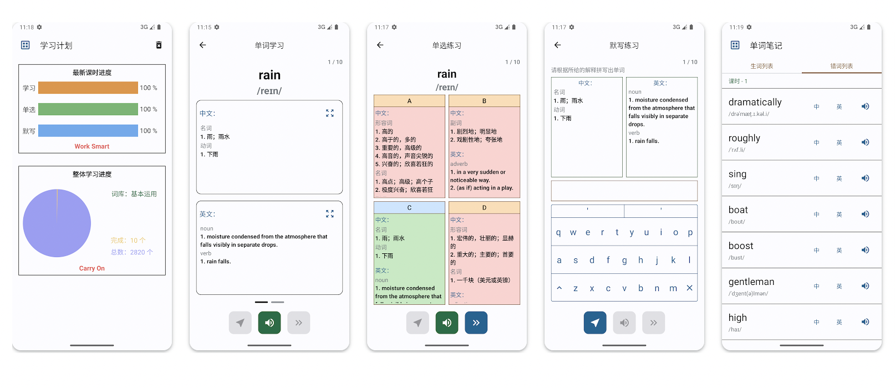

# Landing 上岸单词

*一款安卓平台的英语单词学习软件*

无需网络运行，完全免费，没有广告。适合初中到大学英语（四六级）或者托福雅思考试的单词部分学习。

[Google Play](https://play.google.com/store/apps/details?id=com.peter.landing&hl=en_US&gl=US)

## 功能介绍

1. 单词学习（有学习计划和进度查看，带练习）
2. 单词搜索（中英解释，英语发音）
3. 音标列表（有单词发音例子）
4. 词缀表格（有单词拼写例子）
5. 单词笔记（生词和错词列表）
6. 支持暗色主题

## 运行截图

## 参考效果

- 我自己用这个配合其他学习材料获得***雅思分数（L:7.5, R:8.5, W:6.5, S:6.0）***

## 说明

- 最低安卓系统版本要求：9.0
- 准备在F-DRIOID发布

## 证书

**上岸单词** 是以遵循 Apache License (Version 2.0) 条款下提供的. 查看
[license](LICENSE) 更多信息.
