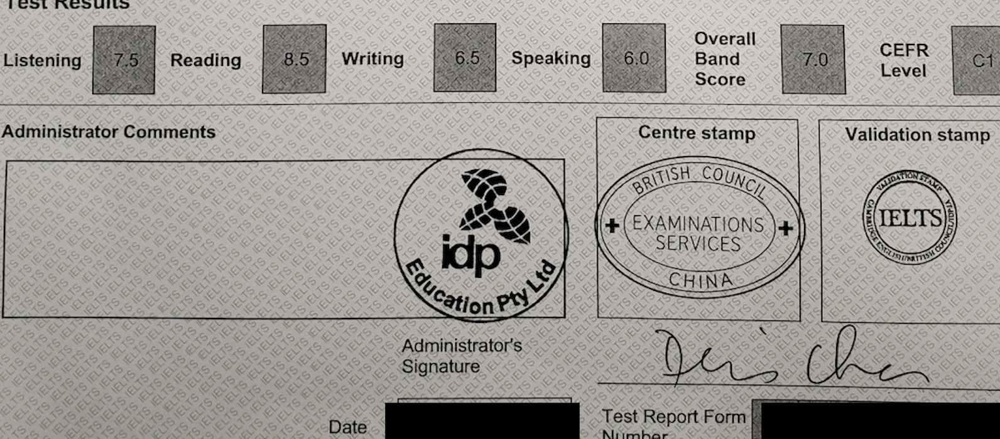

# Landing 上岸单词

*一款安卓平台的英语单词学习软件*

无需网络运行，完全免费，没有广告。适合初中到大学英语（四六级）或者托福雅思考试的单词部分学习。

[Google Play](https://play.google.com/store/apps/details?id=com.peter.landing&hl=en_US&gl=US)

## 功能介绍

1. 单词学习（有学习计划和进度查看，带练习）
2. 单词搜索（中英解释，英语发音）
3. 音标列表（有单词发音例子）
4. 词缀表格（有单词拼写例子）
5. 单词笔记（生词和错词列表）
6. 支持暗色主题

## 参考效果

- 我自己用这个配合其他学习材料获得***雅思分数（L:7.5, R:8.5, W:6.5, S:6.0）***

## 说明

- 2.0.0
  - 简化单词学习流程
  - 数据库表结构改了，没提供migrate file，无法直接从旧版本升级
  - 删除了domain层来简化代码
  - 修复一点点错误，优化一点点代码逻辑
  - 用Compose重写了界面，图表直接用canvas画了
  - 因为APP比较简单，所以不再提供测试代码了。
  - 会准备在F-DRIOID发布

## 其他

- 英语学习，多读多写多看多说，练习每天都有就好。音标和发音尽量准确，尤其是初学期（无需太在意口音，这可是欢乐的地方）。
- 愿你们都拿到满意的成绩，去到想去的土地。
- 拿我代码交作业或者毕设，得了奖学金记得请人吃饭积德